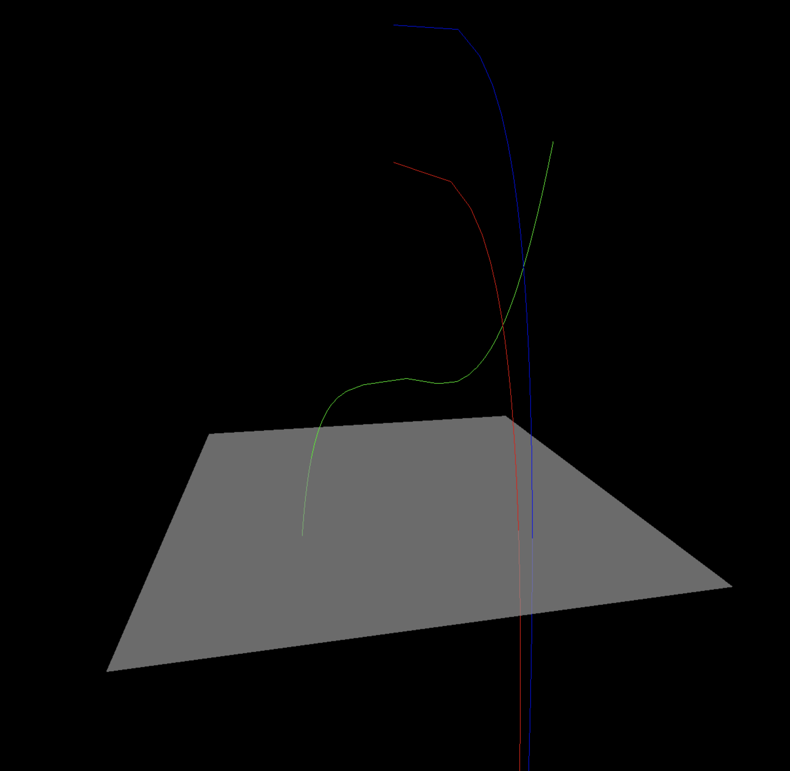

# Norns

A three.js-driven multiple timeline and relationship visualisation.

Taken from the Norse mythological deities *The Norns* which weave the threads of the destinies of men.
The Norns represent past, present and future.

Likewise, this visualisation aims to display lines moving vertically downward through time and laterally through space.

The proximity of lines at any point in time indicate spatial proximity, which could mean they are friends, lovers or colleagues.

Lines may also begin and end according to birth and death; this staggered arrangement can show bereavement when one line carries on whilst another terminates.

## Screenshot

